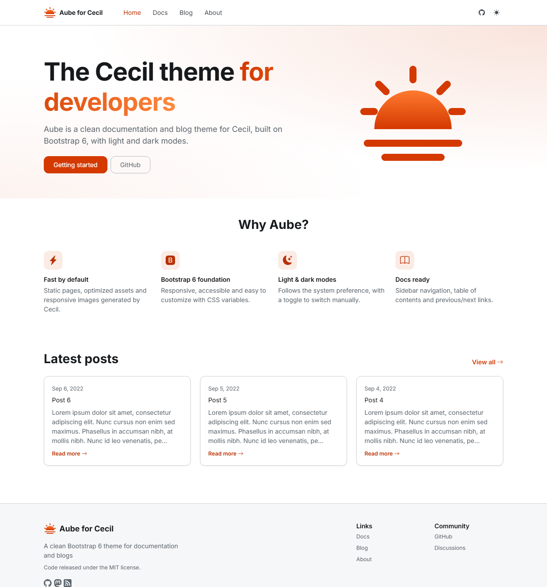

# Aube theme

The _Aube_ theme for [Cecil](https://cecil.app) is a clean documentation and blog theme built on [Bootstrap 6](https://getbootstrap.com).



## Features

- Bootstrap 6 (CSS and JS bundle downloaded at build time by Cecil)
- Light, dark and auto color modes, with a toggle in the navbar
- Customizable primary color, logo and Google Font (Inter by default)
- Home page with a hero, a features grid and the latest posts
- Blog: cards, pagination, date, reading time, tags and previous/next links
- Documentation: sidebar navigation (grouped), sticky table of contents with scroll spy, previous/next links
- Breadcrumb, "copy" button on code blocks, Cecil notes (`:::tip`) styled as alerts
- Footer with link columns and social icons ([Bootstrap Icons](https://icons.getbootstrap.com))
- Accessible: skip link, ARIA labels, responsive drawer menu
- Translatable (English and French included)

## Installation

```bash
composer require cecil/theme-aube
```

> Or [download the latest archive](https://github.com/Cecilapp/theme-aube/releases/latest/) and uncompress its content in `themes/aube`.

## Usage

Add `aube` in the `theme` section of your `config.yml`:

```yaml
theme:
  - aube
```

### Home page

The home page is built from the `pages/index.md` front matter:

```yaml
---
title: Home
pagination: false
hero:
  title: 'The Cecil theme <span class="text-gradient">for developers</span>'
  text: 'A short introduction.'
  image: images/logo.svg      # optional, path in assets/
  buttons:
    - text: Getting started
      url: docs
    - text: GitHub
      url: https://github.com/Cecilapp/Cecil
      style: outline-secondary # Bootstrap button variant (solid, outline, subtle, text) and theme color, e.g. "primary" or "outline-secondary"
features:
  title: Why Aube?
  items:
    - icon: lightning-charge-fill # name of an icon in assets/icons/
      title: Fast by default
      text: Static pages and optimized assets.
---
```

The latest pages of the `aube.home.section` section (`blog` by default) are listed below.

### Documentation

Pages of the `docs` section use the documentation layout. Sidebar entries are ordered by `weight` and grouped by the `group` front matter variable:

```yaml
---
title: Getting started
description: Install Cecil and enable the theme.
weight: 10
group: Introduction
---
```

To apply this layout to another section (e.g. `guide`), create `layouts/guide/page.html.twig` and `layouts/guide/list.html.twig` in your site, extending respectively `docs/page.html.twig` and `docs/list.html.twig`.

Set `toc: false` in the front matter of a page to hide its table of contents.

### Menu

```yaml
menus:
  main:
    - id: docs
      name: Docs
      url: docs
      weight: 10
```

### Icons

Icons are SVG files from [Bootstrap Icons](https://icons.getbootstrap.com) stored in `assets/icons/`. Add your own by dropping a SVG file in your site's `assets/icons/` folder, then use it in templates:

```twig
{{ include('partials/icon.html.twig', {name: 'github', class: 'me-1'}, with_context = false) }}
```

### Configuration

Default values:

```yaml
aube:
  logo: images/logo.svg        # logo path in assets/ (empty to hide)
  font:
    family: Inter              # Google Fonts family (empty to use the system font stack)
    weights: '400;600;700'
  colors:
    primary: '#d43900'         # Bootstrap primary color
    secondary: ''              # empty to keep Bootstrap's neutral secondary color
  color_mode:
    enabled: true              # show the light/dark/auto toggle
    default: auto              # auto, light or dark
  navbar:
    fixed: true                # sticky navbar
  home:
    section: blog              # section of the pages listed on the home page
    limit: 3
    title: Latest posts
  posts:
    sections: [blog]           # sections whose pages display date and reading time
  toc:
    enabled: true
    min: 2                     # minimum number of headings to display it
  breadcrumb: true
  copy_code: true
  readtime: true
  social: []                   # list of {name, url, icon, navbar}
  footer:
    columns: []                # list of {title, links: [{name, url}]}
    text: ''                   # Markdown
    powered_by: true
  bootstrap:
    version: 6.0.0-alpha.1
```

Example:

```yaml
aube:
  colors:
    primary: '#0d6efd'
  social:
    - name: GitHub
      url: https://github.com/Cecilapp/Cecil
      icon: github
      navbar: true             # also displayed in the navbar
  footer:
    columns:
      - title: Links
        links:
          - { name: Docs, url: docs }
          - { name: Blog, url: blog }
```

The theme also sets the following Cecil options (your configuration always wins): `taxonomies.tags`, `pages.pagination.max: 6`, `pages.body.images.class: img-fluid rounded` and `pages.body.toc: [h2, h3]`.

### Layout blocks

`_default/page.html.twig` defines the following blocks you can override: `head`, `head_metatags`, `head_css`, `body_class`, `header`, `main`, `breadcrumb`, `content`, `footer` and `scripts`.

## Internationalization

The theme is translated in English and French (`translations/messages.fr.yml`). To add a language, extract strings with:

```bash
php cecil.phar util:translations:extract --locale=<locale> --save --theme=aube
```

## Development

### Demo site

```bash
composer demo:link   # links the theme as `demo/themes/aube`
cecil serve demo
```

## Credits

- Inspired by [Hinode](https://gethinode.com) by Mark Dumay
- [Bootstrap](https://getbootstrap.com) and [Bootstrap Icons](https://icons.getbootstrap.com) (MIT)

## License

_Aube_ is a free software distributed under the terms of the MIT license.
